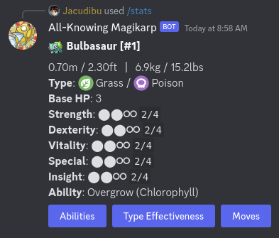
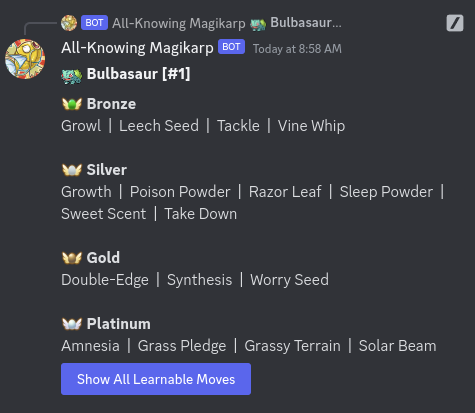
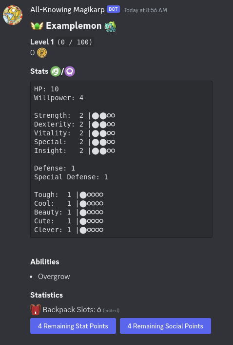
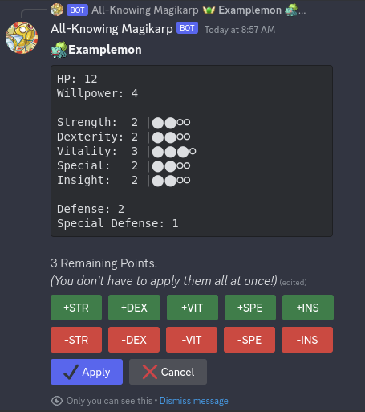

A discord bot to support playing a homebrewed, Mystery-Dungeon Themed version
of [Pokerole](https://www.pokeroleproject.com).

You can add it to your own
server [using this link](https://discord.com/oauth2/authorize?client_id=1113153708201615430&permissions=9089493346368&scope=applications.commands%20bot).
If you are fine with our
custom changes to the Pokerole Systems, feel free to just use it there for your own needs. Any persistent
data is server specific, so there's no need to worry about breaking anything.

# Features

Quickly get an overview of any Pokemon's stats, moves, abilities...

Create and keep track of your characters with the bot!

Lots of tiny quality of life things

- View all moves a pokemon can learn in the games through TMs/Tutors/Breeding
- Type effectiveness charts
- Automatic Emoji upload for newly created characters
- Automated database backup into a discord channel of your choice
- Separate Wallets for shops, guilds, NPCs...
  ...and a bunch more, pretty much anything to run your Pokerole campaign!

# Contributing

Contributions of any kind are always welcome!
If it's a bigger feature just let me know what you want to work on by creating an issue first, to avoid accidental
duplicate work.
Also feel free to join the [development discord server](https://discord.gg/jVrv2YG2zU)!

# Running the bot yourself

As long as you got a working rust environment set up, this should be fairly straightforward.

### Environment Variables

We poll and combine data from different sources, this allows us to update the data inside the bot without requiring a
new build for every minor addition. In order to get this to work, the executable requires the following environment
variables to be set:

- **POKEMON_API** – path to a local clone of the [pokeAPI](https://github.com/PokeAPI/pokeapi) git repository
- **POKEMON_API_SPRITES** - Optional. Path to a local clone of the [pokeAPI Sprites](https://github.com/PokeAPI/sprites)
  git
  repository. Only needed if you want to generate emojis for your characters.
- **POKEROLE_DATA** – path to a local clone of
  the [Pokerole-Data](https://github.com/Pokerole-Software-Development/Pokerole-Data) git repository
- **CUSTOM_DATA** – path to your custom data overrides. In our case,
  that's https://github.com/Jacudibu/pokerole-custom-data.
- **DISCORD_TOKEN** – the Discord Token for your bot.
- **DATABASE_URL** – URL to the SQLite database file.
- **DB_BACKUP_CHANNEL_ID** – Optional. Discord Channel ID into which daily backups should be posted.
